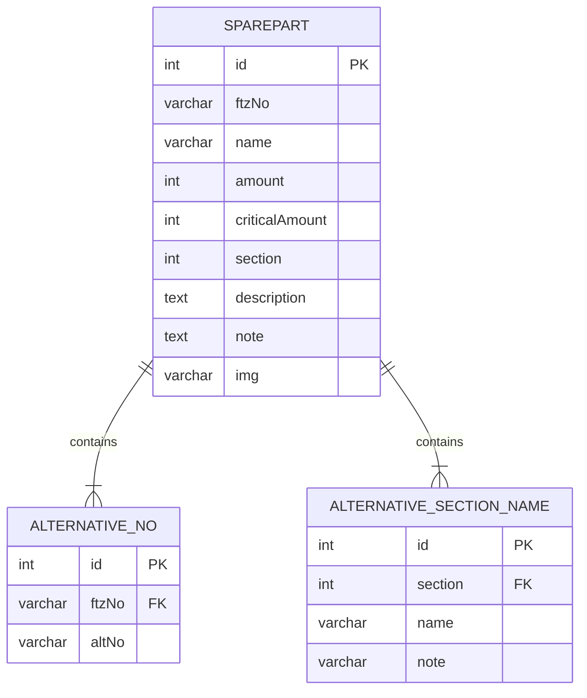

# Inventory system
A project to help educators and students sort, track and get parts for various different vocational educations.
Built on Svelte with SvelteKit, using PostgreSQL and C#, with ASP.NET Core, for the backend.

## Entity Relations

## Wireframe

