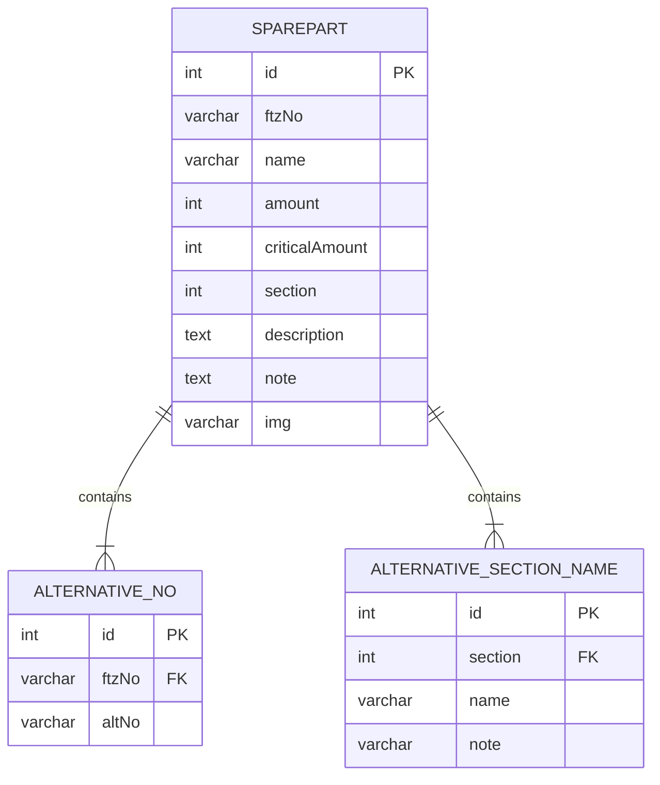

# The project

In this project we are designing a system in which craftsmen are able to see what they have in their inventory using a web frontend.

## Analysis

### Used technologies

- [ASP.net](https://dotnet.microsoft.com/en-us/apps/aspnet)
- [SvelteKit](https://kit.svelte.dev)
- [MariaDB](https://mariadb.org)
- [Nix](https://nixos.org)

### Entity relations diagram

## Requirements

### Functional requirements

- The user needs to be able see everything they have in their inventory.
- The user needs to be able to specify what they'd like to borrow from the inventory.
- The user needs to be able to specify the amount of something that they'd like to borrow.
- The user needs to be able to filter what they'd like to see in the inventory view.

### Non-functional requirements

- The system needs to be easy to use.
- The system needs to be highly performant, even under load.
- The list of what's in their inventory, needs to be updated frequently, in order to keep up with any demand.
- The system should use and SQL database to keep track of the inventory.

## Implementation

## Conclusion

## References
