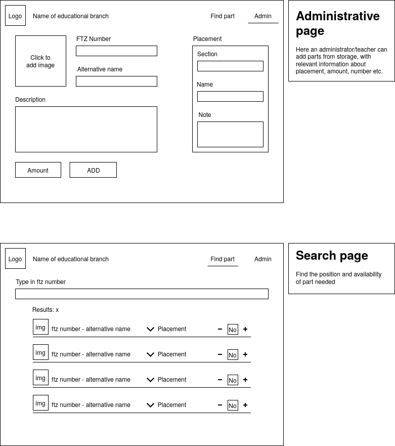

# Introduction

This Project is made for mechanic students. The main reason behind making of this product is so that mechanic students can easily see how if they have enough amount of the tool or whatever they need in their inventory.

Program can store information about like number of tools and other things. Just like its administrative page you can easily understand what this program is capable of.

## Wireframe

### Administrative

As you can you can add

- An image
- FTZ number
- A name
- Description

And on the right side you can see where can I find it

- Section
- Name
- Note

From this you can see that administrative page is the main page of this program, adding all the main information.

After adding all the information on the administrative page, user given info will go to the next page called Search Page

### Search page

As you can see it simple show how the information will look like in the end

You will see an image of the product and both it number and name next to it. On the right side you have option of placement and how many you want to place.

If you look at the head of the program you can see at the left side you have a logo and the name of the educational branch. On the right side you have the option to change page but clicking on it like right now you are on the search page but if you want to go back to the administrative page you can just click on the Admin on the top right side.

Because of this program user will be able to easily access everything they have in their inventory. At first user will be able to see all everything but if your wants to see a specific thing user can just type its name or its FTZ number in the textbox underneath the label where it says “Type in ftz number”

User will be able to easily tell what they’d like to borrow, the amount of something that they’d like to borrow.

## Analysis

### Used technologies

- [ASP.net](https://dotnet.microsoft.com/en-us/apps/aspnet)
- [SvelteKit](https://kit.svelte.dev)
- [MariaDB](https://mariadb.org)
- [Nix](https://nixos.org)

### Entity relations diagram

## Requirements

### Specifications

- Admin can configure the product’s critical amount manually.
- System will let user know if the product reaches its critical amount.
- Only admin can change the minimum critical amount of a product that a product can reach.
- Admin can add a maximum amount for a product to be borrowed manually.
- System will let user know if the amount of product user wants to borrowed is over the maximum number.
- Only admin can change the maximum amount of a product that can be borrowed.

### Specific requirements

- Use C# in the backend.
- The system uses MariaDB

### Functional requirements

- The user needs to be able see everything they have in their inventory.
- The user needs to be able to specify what they'd like to borrow from the inventory.
- The user needs to be able to specify the amount of something that they'd like to borrow.
- The user needs to be able to filter what they'd like to see in the inventory view.
- The frontend needs to display an image of the item.

### Non-functional requirements

- The system needs to be easy to use.
- The system needs to be highly performant, even under load.
- The list of what's in their inventory, needs to be updated frequently, in order to keep up with any demand.
- The system should use and SQL database to keep track of the inventory.

## Implementation

- We expect the project to be run on a Linux based server, although it may be cross-platform.

### User Guide

- [inventory system api guide](../api/README.md) Inside of the README.md

## Conclusion

## References

- [entity relations](../README.md) Inside of the README.md
